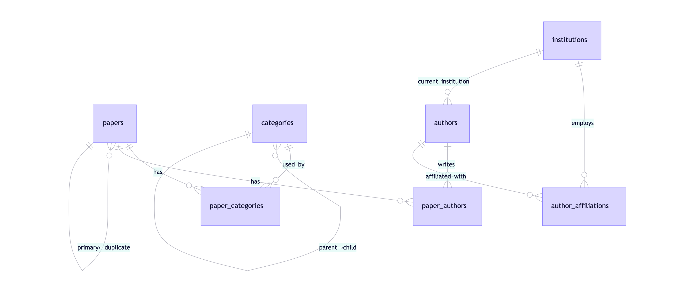

# 预印本论文数据库设计说明

## 1. 设计目标

本数据库服务于多平台预印本论文自动抓取、去重、存储与分析系统，核心目标包括：

- 完整保留各平台原始元数据
- 支持跨平台内容去重（主-从论文模型）
- 结构化存储作者与机构信息（含历史）
- 统一管理多平台分类体系（支持层级与多语言）
- 支持论文标题/摘要的多语言版本
- 便于高效查询、统计与扩展

## 2. 数据库结构图

## 3. 关键表说明

### papers

存储每篇论文的核心信息，无论来源平台。

- **raw_metadata**: 保留平台返回的完整原始数据（JSON/XML 转 JSONB）
- **is_primary + primary_paper_id**: 实现跨平台去重：内容相同的论文中，仅一篇标记为 `is_primary = TRUE`，其余指向它
- **hash_sha256**: 基于 `title + \n + abstract` 计算，用于识别重复内容
- **title_i18n / abstract_i18n**: 支持未来多语言翻译（如中文摘要）

### categories

统一分类体系，覆盖 arXiv、bioRxiv 等平台。

- 支持层级结构（如 Computer Science → Computer Vision）
- **names_i18n** 支持多语言显示（如前端按用户语言展示分类名）
- 初始化时需导入各平台官方分类列表

### paper_categories

多对多关联表，记录论文所属的所有分类。

- **is_primary = TRUE** 标记该论文的主分类（每篇论文仅一个）

### institutions

标准化机构库，避免"Tsinghua University" vs "Tsinghua Univ"问题。

- 优先使用 **ROR ID** 作为全球唯一标识
- **aliases** 字段存储常见别名，便于匹配

### authors + author_affiliations

- **authors**: 存储作者基本信息
- **author_affiliations**: 记录作者的完整任职历史（含起止时间）
- **paper_authors.raw_affiliations**: 保留投稿时的原始机构信息（可能未标准化）
- **paper_authors.affiliation_institution_ids**: 存储标准化后的机构ID（用于分析）

### daily_stats

记录每日抓取统计，用于监控与生成 CSV 报告。

- 字段 **stats_json** 包含各平台数量、去重前后总数等

## 4. 多平台字段映射策略

| 平台 | 原始字段 | 映射到 |
|------|---------|--------|
| arXiv | `categories`, `primary_category` | `paper_categories` + `categories` 表 |
| bioRxiv | `category`, `subject_areas` | `paper_categories`（若结构化）或 `keywords`（若自由文本） |
| OSF | `tags` | `keywords` |
| 所有平台 | `title`, `abstract` | `papers.title`, `papers.abstract` + `*_i18n` |

## 5. 查询优化建议

- 使用 **GIN 索引**加速全文模糊搜索（需 `pg_trgm`）
- 按分类查询：`JOIN paper_categories + categories`
- 按机构查论文：通过 `paper_authors → authors → institutions`
- 去重论文查询：`WHERE is_primary = TRUE`

## 6. 扩展性说明

- **新增平台**：只需向 `categories` 插入新 `platform` 的分类，并调整抓取逻辑
- **新增语言**：直接向 `title_i18n` / `names_i18n` 添加新语言键值
- **引用更新**：后台任务定期调用 Semantic Scholar / OpenAlex API 更新 `citation_count`
- **机构标准化**：可集成 ROR API 自动匹配 `raw_affiliations`

## 7. 初始化步骤

1. 执行 `schema.sql`
2. 导入各平台分类数据到 `categories` 表
3. （可选）预加载知名机构到 `institutions` 表
